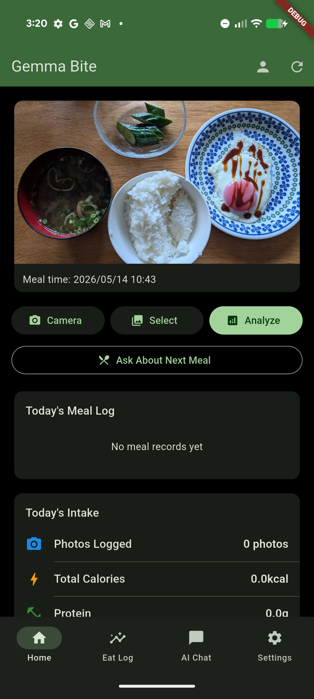
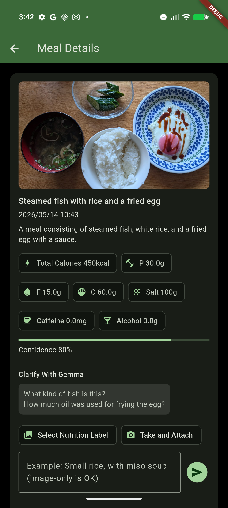
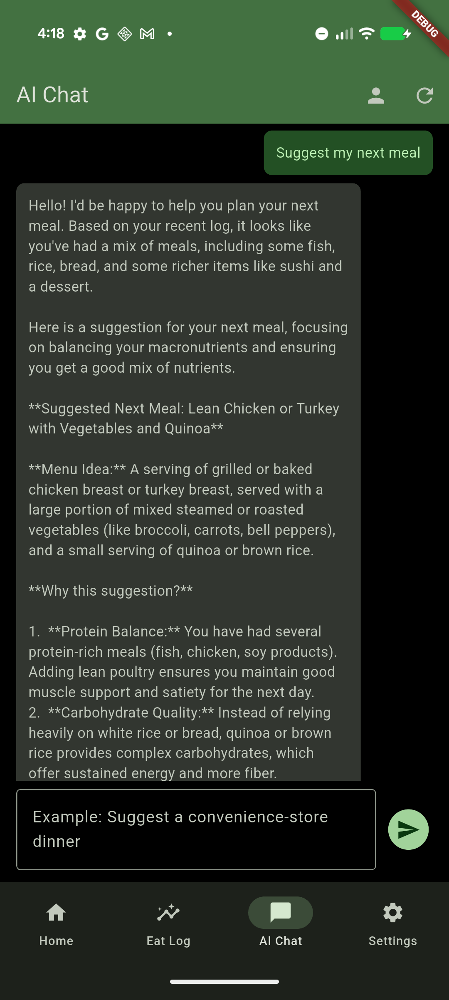
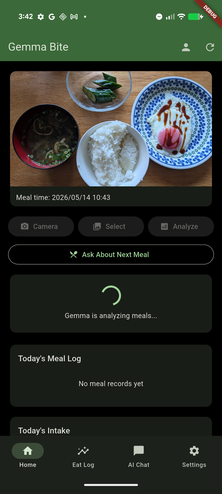
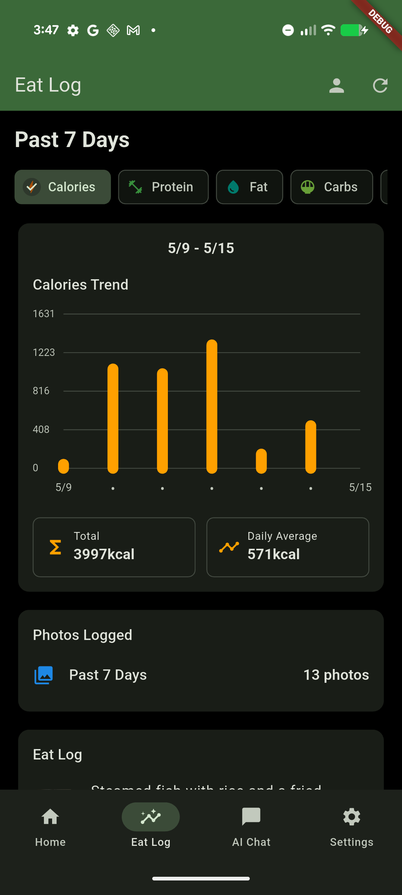
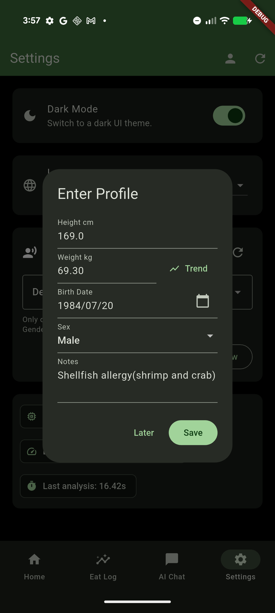
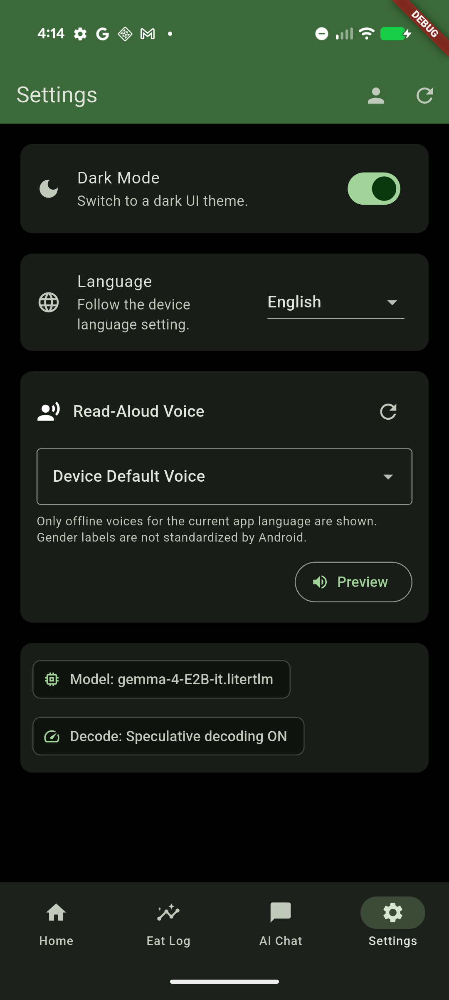
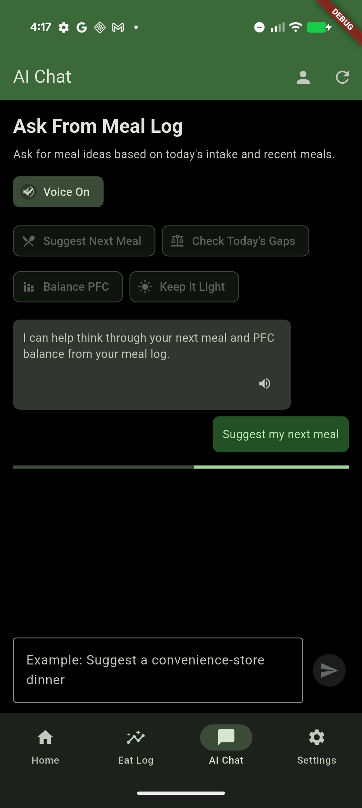
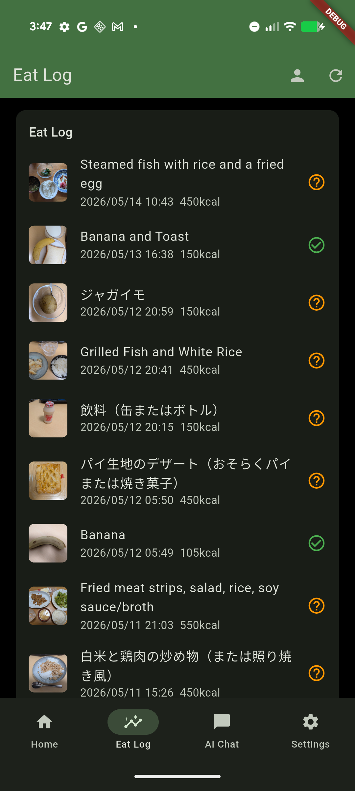

# Gemma Bite

Gemma Bite is an Android-first meal nutrition assistant powered by on-device Gemma 4. Take or select meal photos, let Gemma estimate nutrition, and ask for profile-aware meal advice without sending your meal data to a server.

Built as a Kaggle competition project, the app focuses on private, offline-friendly food logging for everyday meals, travel, and low-connectivity situations.

[Japanese README](README_JA.md)

<p align="center">
  
  
  
</p>

## Highlights

- **On-device Gemma 4 meal analysis**: estimates calories, protein, fat, carbohydrates, salt, caffeine, and alcohol from meal photos.
- **Batch photo analysis**: select multiple photos and process them as separate meal records.
- **Duplicate prevention**: avoids registering the same meal photo multiple times.
- **Profile-aware AI chat**: uses height, weight, gender, birthday, weight history, and notes such as allergies or food restrictions when suggesting the next meal.
- **Meal log and trends**: records meals by photo timestamp and summarizes daily intake.
- **Nutrition label refinement**: attach a nutrition label or reference image to improve an existing estimate.
- **Read-aloud replies**: Android Text-to-Speech can read AI consultation responses using local device voices.
- **English and Japanese UI**: follows the Android device language by default, with an in-app language setting.

## Screenshots

### English UI

| Home | Analysis | Meal Detail |
|---|---|---|
|  |  |  |

| Eat Log | Profile | Settings |
|---|---|---|
|  |  |  |

| AI Chat | AI Recommendation | Eat Log Summary |
|---|---|---|
|  |  |  |

Japanese UI screenshots are available in [README_JA.md](README_JA.md).

## How It Works

Gemma Bite combines a Flutter UI with a native Android Gemma inference layer.

1. The user takes or selects one or more meal photos.
2. Flutter sends the image path to Android through a platform channel.
3. Android loads the Gemma 4 LiteRT-LM model and runs multimodal inference on device.
4. The model returns structured JSON for the meal name, summary, nutrition values, confidence, and follow-up questions.
5. The app stores meal records locally and uses them, together with the user profile, for AI consultation.

```text
Flutter UI
  -> MethodChannel
  -> Android Kotlin
  -> LiteRT-LM Engine
  -> Gemma 4 E2B model
```

## Tech Stack

- Flutter / Dart
- Android Kotlin platform channel
- Google AI Edge LiteRT-LM
- Gemma 4 E2B LiteRT-LM model
- Android Text-to-Speech
- ML Kit Japanese Text Recognition for nutrition label OCR

## Getting Started

### Prerequisites

- Flutter SDK
- Android Studio or Android SDK command-line tools
- Android device or emulator
- `adb`
- A Gemma 4 LiteRT-LM `.litertlm` model file

The Gemma model is not included in this repository. Download it separately and make sure you follow the model provider's license and access requirements.

### Download the Model

Gemma Bite is developed with the LiteRT-LM Gemma 4 E2B model:

<https://huggingface.co/litert-community/gemma-4-E2B-it-litert-lm>

```bash
pip install huggingface_hub
huggingface-cli login
huggingface-cli download litert-community/gemma-4-E2B-it-litert-lm --local-dir ./models/gemma-4-E2B-it-litert-lm
```

### Place the Model on Android

Install or run the app once before pushing the model so Android creates the
app-owned external files directory. Do not create the `models` directory with
`adb shell mkdir`; on recent Android versions that can make the directory owned
by `shell`, and the app may not be able to list the model file.

```bash
APP_ID=com.eyuras.gemma_bite
MODEL_DIR="/storage/emulated/0/Android/data/$APP_ID/files/models"
MODEL_PATH=./models/gemma-4-E2B-it-litert-lm/gemma-4-E2B-it.litertlm

# Start the installed app once. It will create $MODEL_DIR and show
# "Model file not found" until the model is pushed.
adb shell am start -W -n "$APP_ID/.MainActivity"
adb shell am force-stop "$APP_ID"

adb push "$MODEL_PATH" "$MODEL_DIR/"
adb shell ls -lh "$MODEL_DIR/"
```

If you need to force model re-optimization after changing the model file:

```bash
adb shell rm -f /storage/emulated/0/Android/data/com.eyuras.gemma_bite/files/models/*.xnnpack_cache_*
```

### Run the App

```bash
flutter pub get
flutter run
```

To run on a specific Android device:

```bash
flutter devices
flutter run -d <device-id>
```

To build an APK:

```bash
flutter build apk
```

## Live Demo via GitHub Releases (Android APK)

If you distribute the Android APK on GitHub Releases, users still need to place a Gemma `.litertlm` model file on the device.
The APK alone cannot run inference.

Build the release APK and rename the generated file before uploading it:

```bash
flutter build apk --release
cp build/app/outputs/flutter-apk/app-release.apk gemma-bite-v1.0.0.apk
shasum -a 256 gemma-bite-v1.0.0.apk > SHA256SUMS
```

This project currently signs the Android `release` build with the debug signing config, so the APK is suitable for demos and manual testing, not Play Store distribution.

### 1) Download release assets

- Download `gemma-bite-v1.0.0.apk` from your GitHub Release.
- Download `gemma-4-E2B-it.litertlm` separately from Hugging Face (license and access rules apply):
  <https://huggingface.co/litert-community/gemma-4-E2B-it-litert-lm>

For example, with the Hugging Face CLI:

```bash
pip install huggingface_hub
huggingface-cli login
huggingface-cli download litert-community/gemma-4-E2B-it-litert-lm --local-dir ./models/gemma-4-E2B-it-litert-lm
```

### 2) Install APK and place model with `adb`

```bash
APP_ID=com.eyuras.gemma_bite
APK_PATH=./gemma-bite-v1.0.0.apk
MODEL_PATH=./models/gemma-4-E2B-it-litert-lm/gemma-4-E2B-it.litertlm

adb install -r "$APK_PATH"

# Launch once so the app creates its own Android/data directory and models
# subdirectory. Do not create this directory with adb shell mkdir; that can leave
# it owned by shell and invisible to the app.
adb shell am start -W -n "$APP_ID/.MainActivity"
adb shell am force-stop "$APP_ID"

MODEL_DIR="/storage/emulated/0/Android/data/$APP_ID/files/models"
adb push "$MODEL_PATH" "$MODEL_DIR/"
adb shell ls -lh "$MODEL_DIR/"

# Optional: restart and launch app
adb shell am force-stop "$APP_ID"
adb shell am start -W -n "$APP_ID/.MainActivity"
```

### 3) First launch behavior

- If the model exists, the app auto-detects `.litertlm` files and initializes the first one.
- If not found, the app shows the expected model directory and waits for model placement.

If you previously created the directory with `adb shell mkdir` and the app still
shows "Model file not found" even though `adb shell ls` shows the model, remove
the shell-owned directory and repeat step 2:

```bash
adb shell rm -rf "/storage/emulated/0/Android/data/com.eyuras.gemma_bite/files/models"
```

### Optional: clear model optimization cache after model replacement

```bash
adb shell rm -f /storage/emulated/0/Android/data/com.eyuras.gemma_bite/files/models/*.xnnpack_cache_*
```

### Recommended files to attach in GitHub Release

- `gemma-bite-v1.0.0.apk`
- `SHA256SUMS` (checksum file for APK)
- `README.md` and `README_JA.md`, or a short `INSTALL.md` / `INSTALL_JA.md` copied from the GitHub Release instructions above

Do not attach the Gemma `.litertlm` model file unless the model provider's license and redistribution terms explicitly allow it.

## Current Scope

- Android is the main target for on-device Gemma inference.
- The iOS project files exist, but the native Gemma inference path is not implemented for iOS.
- Nutrition values are estimates and should not be treated as medical advice.
- Android read-aloud voices depend on the local TTS voices installed on the device.
- Network-required TTS voices are intentionally hidden so read-aloud can stay local/offline-friendly.

## Repository Notes

- English screenshots live in `docs/images/en/`.
- Japanese screenshots live in `docs/images/ja/`.
- Model files should stay outside the repository. The `models/` directory is ignored by Git.
- Local screenshot captures matching `screenshot*.png` are ignored by Git.
