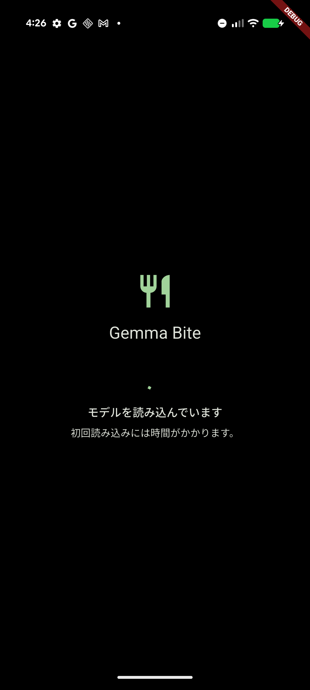
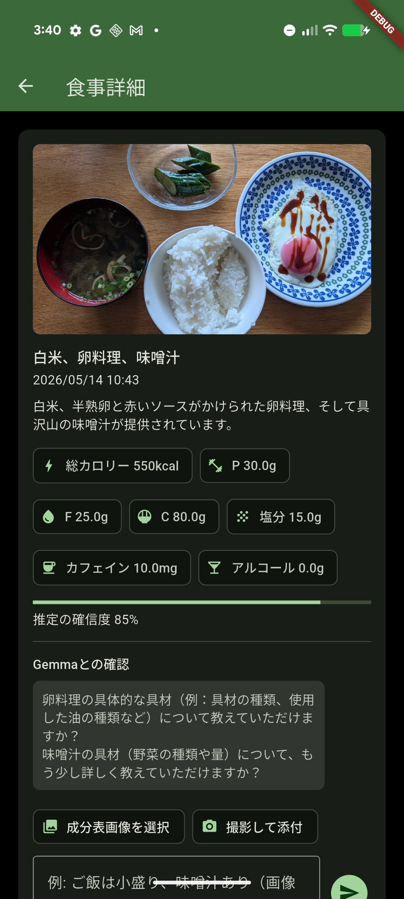
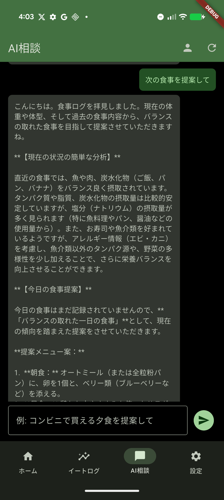
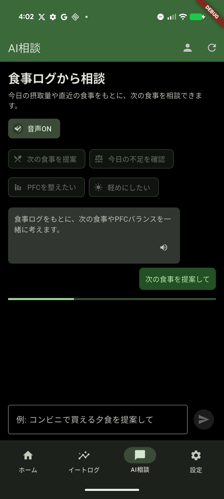
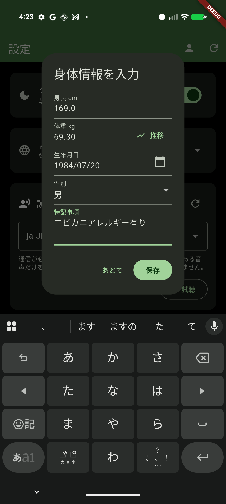
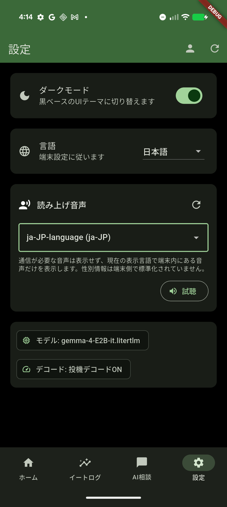

# Gemma Bite

Gemma Bite は、食事写真から Gemma 4 がオンデバイスでカロリーや栄養素を推定する Android 向けの食事記録アプリです。食事写真を撮影または選択すると、Gemma が栄養情報を推定し、プロフィールを考慮した食事相談まで行えます。

Kaggle コンペティション応募用のプロジェクトとして、プライバシーを守りやすく、通信しづらい環境でも使いやすい食事ログ体験を目指しています。

[English README](README.md)

<p align="center">
  
  
  
</p>

## 主な機能

- **Gemma 4 によるオンデバイス食事分析**: 食事写真からカロリー、タンパク質、脂質、炭水化物、塩分、カフェイン、アルコールを推定します。
- **複数写真の一括分析**: 登録していない写真を複数選択し、1枚ずつ食事記録として分析できます。
- **重複登録の防止**: 同じ食事写真を複数回登録しないようにチェックします。
- **プロフィールを考慮したAI相談**: 身長、体重、性別、生年月日、体重履歴、Notes のアレルギーや制限事項を踏まえて次の食事を提案します。
- **食事ログと摂取量の集計**: 写真の撮影時刻を使って食事時刻を記録し、1日の摂取量を確認できます。
- **栄養成分表による補正**: 栄養成分表や参考画像を添付して、推定結果をより正確にできます。
- **読み上げ機能**: Android の Text-to-Speech を使って、AI相談の回答を端末内の音声で読み上げます。
- **日本語・英語UI**: 端末の言語設定に追従しつつ、アプリ内設定で言語を切り替えられます。

## スクリーンショット

### 日本語UI

| ホーム | 食事詳細 | AI相談 |
|---|---|---|
|  |  |  |

| AI相談入力 | プロフィール | 設定 |
|---|---|---|
|  |  |  |

英語UIのスクリーンショットは [README.md](README.md) に掲載しています。

## 仕組み

Gemma Bite は Flutter UI と Android ネイティブの Gemma 推論処理を組み合わせています。

1. ユーザーが食事写真を撮影、または1枚以上選択します。
2. Flutter から Android へ platform channel 経由で画像パスを渡します。
3. Android 側で Gemma 4 LiteRT-LM モデルを読み込み、オンデバイスでマルチモーダル推論します。
4. モデルは食事名、概要、栄養値、推定信頼度、追加確認事項を JSON で返します。
5. アプリは食事記録をローカルに保存し、プロフィールと合わせて AI相談に利用します。

```text
Flutter UI
  -> MethodChannel
  -> Android Kotlin
  -> LiteRT-LM Engine
  -> Gemma 4 E2B model
```

## 技術構成

- Flutter / Dart
- Android Kotlin platform channel
- Google AI Edge LiteRT-LM
- Gemma 4 E2B LiteRT-LM model
- Android Text-to-Speech
- ML Kit Japanese Text Recognition による栄養成分表OCR

## セットアップ

### 前提

- Flutter SDK
- Android Studio または Android SDK command-line tools
- Android 端末またはエミュレータ
- `adb`
- Gemma 4 LiteRT-LM の `.litertlm` モデルファイル

モデルファイルはこのリポジトリには含めません。別途ダウンロードし、モデル提供元のライセンスや利用条件に従ってください。

### モデルのダウンロード

Gemma Bite は LiteRT-LM 用の Gemma 4 E2B モデルで開発しています。

<https://huggingface.co/litert-community/gemma-4-E2B-it-litert-lm>

Hugging Face から次のモデルファイルをダウンロードしてください。

<https://huggingface.co/litert-community/gemma-4-E2B-it-litert-lm/blob/main/gemma-4-E2B-it.litertlm>

以下のインストールコマンドを使う場合は、ダウンロードした
`gemma-4-E2B-it.litertlm` を作業ディレクトリに置いてください。

### Android 端末へのモデル配置

モデルをpushする前に、アプリを一度インストールまたは起動して Android の
app-owned な external files ディレクトリを作らせてください。`adb shell mkdir` で
`models` ディレクトリを作ると、最近の Android では所有者が `shell` になり、
アプリからモデルファイルを一覧できないことがあります。

```bash
APP_ID=com.eyuras.gemma_bite
MODEL_DIR="/storage/emulated/0/Android/data/$APP_ID/files/models"
MODEL_PATH=./gemma-4-E2B-it.litertlm
MODEL_NAME=gemma-4-E2B-it.litertlm

# インストール済みのアプリを一度起動します。アプリが $MODEL_DIR を作成し、
# モデル配置までは "Model file not found" を表示します。
adb shell am start -W -n "$APP_ID/.MainActivity"
sleep 3
adb shell am force-stop "$APP_ID"

adb shell ls -ld "$MODEL_DIR"
adb push -Z "$MODEL_PATH" "$MODEL_DIR/$MODEL_NAME"
adb shell ls -lh "$MODEL_DIR/"
```

モデル変更後に再最適化したい場合:

```bash
adb shell rm -f /storage/emulated/0/Android/data/com.eyuras.gemma_bite/files/models/*.xnnpack_cache_*
```

### 実行

```bash
flutter pub get
flutter run
```

特定の Android 端末で実行する場合:

```bash
flutter devices
flutter run -d <device-id>
```

APK をビルドする場合:

```bash
flutter build apk
```

## Android デモAPKのインストール

Android APK で推論を実行するには、Gemma の `.litertlm` モデルファイル配置が必要です。
APK だけでは推論を実行できません。

### 1) 配布物を取得

- GitHub Release から `gemma-bite-v1.0.0.apk` をダウンロード
- Hugging Face から `gemma-4-E2B-it.litertlm` をダウンロード（ライセンス・利用条件に従ってください）
  <https://huggingface.co/litert-community/gemma-4-E2B-it-litert-lm/blob/main/gemma-4-E2B-it.litertlm>

この2つのファイルを同じローカルディレクトリに置いてから、次のコマンドを実行してください。

### 2) `adb` でAPKインストールとモデル配置

```bash
APP_ID=com.eyuras.gemma_bite
APK_PATH=./gemma-bite-v1.0.0.apk
MODEL_PATH=./gemma-4-E2B-it.litertlm
MODEL_DIR="/storage/emulated/0/Android/data/$APP_ID/files/models"
MODEL_NAME=gemma-4-E2B-it.litertlm

# 再インストール・やり直し時の任意クリーンアップ。
# 以前にpushしたモデルファイルを含む、アプリ専用の外部データを削除します。
adb shell rm -rf "/storage/emulated/0/Android/data/$APP_ID"

adb install -r "$APK_PATH"

# アプリを一度起動して、アプリ自身に Android/data 配下と models
# サブディレクトリを作らせます。adb shell mkdir で作ると所有者が shell になり、
# アプリから見えないことがあります。
adb shell am start -W -n "$APP_ID/.MainActivity"
sleep 3
adb shell am force-stop "$APP_ID"

adb shell ls -ld "$MODEL_DIR"
adb push -Z "$MODEL_PATH" "$MODEL_DIR/$MODEL_NAME"
adb shell ls -lh "$MODEL_DIR/"

adb shell am start -W -n "$APP_ID/.MainActivity"
```

### 3) 初回起動時の挙動

- `.litertlm` が存在すれば自動検出して最初のモデルを初期化します。
- 見つからない場合は、モデル配置先パスを画面に表示して待機します。

以前に `adb shell mkdir` でディレクトリを作っていて、`adb shell ls` ではモデルが
見えるのにアプリが "Model file not found" を表示し続ける場合は、shell所有の
ディレクトリが残っている可能性があります。手順2のクリーンアップコマンドを実行してから、
インストールをやり直してください。

### 任意: モデル差し替え後に最適化キャッシュを削除

```bash
adb shell rm -f /storage/emulated/0/Android/data/com.eyuras.gemma_bite/files/models/*.xnnpack_cache_*
```

メンテナー向けのRelease作成手順は [docs/RELEASE_JA.md](docs/RELEASE_JA.md) にあります。

## 現在の範囲

- オンデバイス Gemma 推論は Android を主対象にしています。
- iOS のプロジェクトファイルはありますが、iOS のネイティブ Gemma 推論処理は未実装です。
- 栄養値は推定であり、医療的な判断には使用しないでください。
- 読み上げ音声は Android 端末にインストールされているローカル音声に依存します。
- 通信が必要な TTS 音声は、オフライン寄りの体験を保つため表示しない方針です。

## リポジトリメモ

- 英語UIのスクリーンショットは `docs/images/en/` に置いています。
- 日本語UIのスクリーンショットは `docs/images/ja/` に置いています。
- モデルファイルはリポジトリに含めません。`models/` は Git 管理対象外です。
- ローカルで取得した `screenshot*.png` は Git 管理対象外です。
